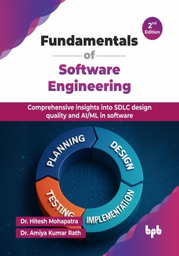

# Fundamentals of Software Engineering - 2nd Edition

Comprehensive insights into SDLC design quality and AI/ML in software.

This is the repository for [Fundamentals of Software Engineering - 2nd Edition
](https://bpbonline.com/products/fundamentals-of-software-engineering-1?variant=44602450116808),published by BPB Publications.

## About the Book
In today's dynamic technological landscape, a strong foundation in software engineering is crucial for building reliable and scalable systems. Fundamentals of Software Engineering (2nd edition) serves as a comprehensive guide, empowering readers with the essential knowledge and skills to excel in this ever-evolving field, now enhanced with insights into cutting-edge advancements.

This book systematically progresses through core software engineering principles, starting with introductory concepts and various SDLC models. It thoroughly covers requirements analysis, project management frameworks, and both structured and object-oriented design methodologies, including UML and use case diagrams. You will learn about interface and database design, coding and debugging practices, and comprehensive software testing strategies. The guide further explores system implementation, maintenance, reliability, and software quality assurance. Significantly, this second edition expands its scope to integrate the transformative impact of AI and ML throughout the SDLC, including the application of large language models in various development phases. To solidify learning, this edition also provides solutions to previous examination question papers.

Upon completing this guide, readers will not only possess a robust understanding of fundamental software engineering principles and established methodologies but will also gain valuable insights into the latest advancements in AI and ML within the software development process. This comprehensive knowledge will equip them to confidently approach real-world software challenges and provide a solid stepping stone for continued growth in this vital discipline.

## What You Will Learn
• Master core SDLC, requirements, project management, and traditional/OO design principles.

• Grasp coding, testing, reliability, CASE, reuse, and recent trends in software engineering.

• Apply structured/OO analysis, interface/database design, and leverage advanced development tools effectively.

• In this 2nd edition, understand the integration of AI and ML (including LLMs) throughout the SDLC.

• Furthermore, in this new edition, learn about cutting-edge AI/ML applications in software engineering and apply practical exam preparation techniques.
